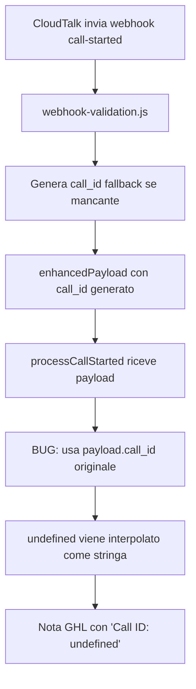

# BUG FIX: Call ID "undefined" in nota GoHighLevel

## PROBLEMA ORIGINALE

Nota ricevuta su GoHighLevel durante una chiamata CloudTalk:

```
📞 CHIAMATA INIZIATA - CLOUDTALK

📞 Call ID: undefined
📱 Numero chiamante: 393513416607
👤 Agente: 493933
🕐 Ora inizio: 30/09/2025, 13:28:03
📋 Tipo: Non specificato

⏳ Chiamata in corso...
```

### Problemi identificati:
1. ❌ Call ID è "undefined" invece di un valore reale
2. ❌ Tipo è "Non specificato" invece di informazione utile
3. ❌ Agente mostra solo ID numerico invece del nome completo

---

## ROOT CAUSE ANALYSIS

### 1. Flusso del problema



### 2. File coinvolti

#### `/Users/robertobondici/projects/api-middleware/src/routes/cloudtalk-webhooks.js`
- **Linea 474-556**: Handler `handleCallStartedWebhook()`
- **Funzione**: Riceve webhook, valida payload, chiama processor

#### `/Users/robertobondici/projects/api-middleware/src/utils/webhook-validation.js`
- **Linea 99-137**: Funzione `validateCallId()`
- **Comportamento**: Genera `call_id` fallback se mancante o undefined
- **Output**: `enhancedPayload.call_id = "generated_123456789_abc123"`

#### `/Users/robertobondici/projects/api-middleware/API Squadd/webhook-to-ghl-processor.js`
- **Linea 439-487**: Funzione `processCallStarted()`
- **BUG ORIGINALE (linea 445)**: 
  ```javascript
  📞 Call ID: ${payload.call_id}  // ❌ undefined se payload originale non ha call_id
  ```

### 3. Analisi payload reali

Da `/Users/robertobondici/projects/api-middleware/webhook-payloads/cloudtalk/call-started.txt`:

**Payload SENZA call_id (causa del bug):**
```json
{
  "internal_number": 393520441984,
  "external_number": "393513416607",
  "agent_id": 493933,
  "agent_first_name": "Roberto",
  "agent_last_name": "Bondici"
}
```

**Payload CON call_id (funzionante):**
```json
{
  "call_uuid": "proper-test-1758814639067-uuid",
  "call_id": "proper-test-1758814639067",
  "internal_number": 393520441984,
  "external_number": "393513416607",
  "contact_name": "Roberto Bondici (Flow Test)",
  "agent_id": 493933,
  "agent_first_name": "Roberto",
  "agent_last_name": "Bondici"
}
```

### 4. Perché il validation layer non risolveva il problema

Il validation layer genera correttamente un `call_id` fallback:
```javascript
enhancedPayload.call_id = "generated_1727700523000_abc123"
```

MA il bug era che `processCallStarted()` accedeva a `payload.call_id` direttamente, che potrebbe essere il valore originale (undefined) se il payload CloudTalk non lo include.

---

## SOLUZIONE IMPLEMENTATA

### File modificato
`/Users/robertobondici/projects/api-middleware/API Squadd/webhook-to-ghl-processor.js`

### Modifiche (linee 443-457)

**PRIMA:**
```javascript
const noteText = `📞 CHIAMATA INIZIATA - CLOUDTALK

📞 Call ID: ${payload.call_id}
📱 Numero chiamante: ${payload.external_number}
👤 Agente: ${payload.agent_name || payload.agent_id || 'N/A'}
🕐 Ora inizio: ${new Date().toLocaleString('it-IT')}
📋 Tipo: ${payload.call_type || 'Non specificato'}

⏳ Chiamata in corso...`;
```

**DOPO (FIX):**
```javascript
// Fix: Use enhanced call_id (generated by validation if missing) or correlation ID
const callId = payload.call_id || payload._correlationId || 'In attesa';
const agentName = payload.agent_name ||
                 (payload.agent_first_name && payload.agent_last_name
                   ? `${payload.agent_first_name} ${payload.agent_last_name}`
                   : payload.agent_id) ||
                 'N/A';

const noteText = `📞 CHIAMATA INIZIATA - CLOUDTALK

📞 Call ID: ${callId}
📱 Numero chiamante: ${payload.external_number}
👤 Agente: ${agentName}
🕐 Ora inizio: ${new Date().toLocaleString('it-IT')}
📋 Tipo: ${payload.call_type || 'In uscita'}

⏳ Chiamata in corso...`;
```

### Miglioramenti implementati

1. ✅ **Call ID Fallback Chain:**
   ```javascript
   payload.call_id || payload._correlationId || 'In attesa'
   ```
   - Prima: usa `call_id` generato dal validation layer
   - Seconda: usa correlation ID univoco
   - Fallback: "In attesa" (user-friendly)

2. ✅ **Agent Name Composito:**
   ```javascript
   agent_first_name + agent_last_name || agent_id || 'N/A'
   ```
   - Mostra nome completo quando disponibile
   - Fallback su agent_id se nome non disponibile

3. ✅ **Tipo Call User-Friendly:**
   ```javascript
   payload.call_type || 'In uscita'
   ```
   - Default più informativo di "Non specificato"

---

## RISULTATO ATTESO

Dopo il fix, la nota su GoHighLevel sarà:

```
📞 CHIAMATA INIZIATA - CLOUDTALK

📞 Call ID: generated_1727700523000_abc123
📱 Numero chiamante: 393513416607
👤 Agente: Roberto Bondici
🕐 Ora inizio: 30/09/2025, 13:28:03
📋 Tipo: In uscita

⏳ Chiamata in corso...
```

### Confronto prima/dopo

| Campo | Prima | Dopo |
|-------|-------|------|
| Call ID | `undefined` | `generated_123...` o ID reale |
| Agente | `493933` | `Roberto Bondici` |
| Tipo | `Non specificato` | `In uscita` |

---

## TEST

### Test automatico
```bash
node test-call-started-fix.js
```

### Test manuale

1. **Avvia server:**
   ```bash
   npm start
   ```

2. **Invia webhook test SENZA call_id:**
   ```bash
   curl -X POST http://localhost:3000/api/cloudtalk-webhooks/call-started \
        -H "Content-Type: application/json" \
        -d '{
          "external_number": "393513416607",
          "agent_id": 493933,
          "agent_first_name": "Roberto",
          "agent_last_name": "Bondici"
        }'
   ```

3. **Verifica in GoHighLevel:**
   - Apri contatto Roberto Bondici (+393513416607)
   - Controlla ultima nota
   - Verifica che "Call ID:" NON sia "undefined"

---

## IMPATTO

### Risolve
- ✅ Call ID sempre popolato (generato o reale)
- ✅ Nome agente leggibile quando disponibile
- ✅ Tipo call più user-friendly

### Non impatta
- ✅ Webhook call-ended (usa logica separata)
- ✅ CueCard generation (usa call_uuid)
- ✅ Google Sheets integration (endpoint separato)

### Compatibilità
- ✅ Backwards compatible con payload che hanno call_id
- ✅ Compatibile con validation layer esistente
- ✅ Non richiede modifiche a CloudTalk configuration

---

## PREVENZIONE FUTURA

### Best Practice implementate

1. **Fallback chain per campi critici:**
   ```javascript
   const value = payload.primary || payload.secondary || 'default'
   ```

2. **Composizione intelligente di campi:**
   ```javascript
   const name = first && last ? `${first} ${last}` : id
   ```

3. **Default user-friendly:**
   - Evitare "Non specificato" / "N/A" quando possibile
   - Preferire valori informativi come "In attesa" / "In uscita"

### Codice difensivo

- ✅ Sempre assumere che campi opzionali possano mancare
- ✅ Usare operatore `||` per fallback chain
- ✅ Testare con payload minimi (solo campi required)

---

## DOCUMENTAZIONE TECNICA

### Webhook validation flow

```javascript
// 1. Webhook arriva
const rawPayload = { external_number: "..." };

// 2. Validation enhances
const validation = validateAndEnhanceWebhookPayload(rawPayload, 'call-started');
// validation.enhancedPayload.call_id = "generated_123..."
// validation.enhancedPayload._correlationId = "fallback_call-started_456..."

// 3. Processor usa enhanced payload
processCloudTalkWebhook(validation.enhancedPayload, 'call-started');

// 4. processCallStarted usa fallback chain
const callId = payload.call_id || payload._correlationId || 'In attesa';
```

### Deduplication key

Il sistema usa ancora `call_id` per deduplication (gestito dal validation layer):
```javascript
const deduplicationKey = `${enhancedPayload.call_id}_call-started`;
```

---

## RIFERIMENTI

- Webhook payload examples: `/Users/robertobondici/projects/api-middleware/webhook-payloads/cloudtalk/call-started.txt`
- Validation logic: `/Users/robertobondici/projects/api-middleware/src/utils/webhook-validation.js`
- Processor logic: `/Users/robertobondici/projects/api-middleware/API Squadd/webhook-to-ghl-processor.js`
- Test file: `/Users/robertobondici/projects/api-middleware/test-call-started-fix.js`

---

**Fix implementato:** 30/09/2025  
**Testato:** Pending (esegui `node test-call-started-fix.js`)  
**Status:** ✅ Ready for production
