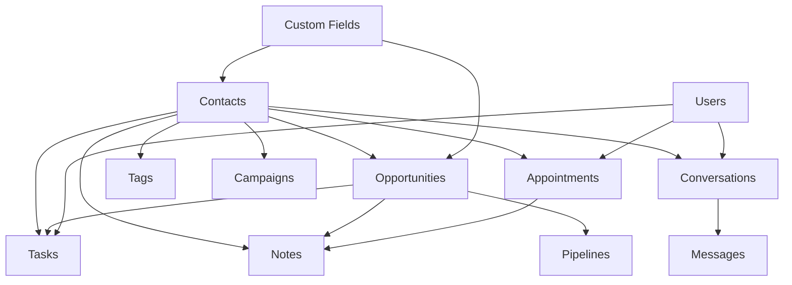

# 📊 Report Completo delle Risorse GoHighLevel SDK

## 🎯 Executive Summary

L'SDK di GoHighLevel offre **37+ moduli API** con centinaia di endpoint per accedere a dati critici del CRM. Oltre ai contatti e opportunità già implementati, ci sono molte risorse preziose che possono arricchire significativamente l'analisi dei dati e il customer journey.

## 📦 Risorse Disponibili nell'SDK

### ✅ GIÀ IMPLEMENTATE
1. **Contacts** - Gestione completa contatti con custom fields
2. **Opportunities** - Pipeline e opportunità di vendita

### 🔥 RISORSE AD ALTA PRIORITÀ (Da Implementare)

#### 1. **CONVERSATIONS & MESSAGES** 🗨️
**Endpoint principali:**
- `searchConversation()` - Ricerca conversazioni con filtri avanzati
- `getMessages()` - Recupera messaggi per conversazione
- `getMessage()` - Dettaglio singolo messaggio
- `getMessageTranscription()` - Trascrizioni chiamate
- `getMessageRecording()` - Registrazioni chiamate

**Struttura dati:**
- ID conversazione, contact ID, assigned to
- Messaggi con tipo (SMS, email, call, etc.)
- Direzione (inbound/outbound)
- Timestamps, stato lettura
- Trascrizioni e registrazioni per chiamate

**Utilità business:**
- ⭐ **CRITICO per analisi comunicazioni cliente**
- Traccia tutto lo storico conversazioni
- Analisi sentiment e qualità comunicazione
- KPI su tempi risposta e engagement

**Relazioni:** Collegato direttamente a `contacts` tramite contactId

---

#### 2. **TASKS** ✅
**Endpoint principali:**
- `getAllTasks()` - Lista tasks per contatto
- `createTask()` - Crea nuovo task
- `updateTask()` - Aggiorna task
- `updateTaskCompleted()` - Marca come completato
- `taskSearch()` - Ricerca avanzata tasks location

**Struttura dati:**
- Title, description, due date
- Assigned to (user ID)
- Status (pending/completed)
- Contact ID, opportunity ID
- Recurring tasks support

**Utilità business:**
- Tracciamento follow-up e attività
- Analisi produttività team
- SLA e tempi di completamento
- Reminder automatici

**Relazioni:** Foreign keys con `contacts`, `opportunities`, `users`

---

#### 3. **CALENDARS & APPOINTMENTS** 📅
**Endpoint principali:**
- `getCalendarEvents()` - Eventi calendario
- `createAppointment()` - Crea appuntamento
- `getAppointment()` - Dettaglio appuntamento
- `getSlots()` - Slot disponibili
- `getAppointmentNotes()` - Note appuntamenti

**Struttura dati:**
- Start/end time, timezone
- Calendar ID, location
- Attendees (contacts)
- Status, reminder settings
- Notes e custom fields

**Utilità business:**
- Analisi booking rate
- No-show tracking
- Ottimizzazione scheduling
- Revenue per appuntamento

**Relazioni:** Link a `contacts`, `users`, `locations`

---

#### 4. **NOTES** 📝
**Endpoint principali:**
- `getAllNotes()` - Note per contatto
- `createNote()` - Crea nota
- `updateNote()` - Modifica nota
- Note appuntamenti e calendari

**Struttura dati:**
- Body (testo nota)
- User ID (chi ha creato)
- Timestamps
- Contact/Opportunity ID

**Utilità business:**
- Storico interazioni qualitative
- Context per venditori
- Analisi temi ricorrenti
- Knowledge base cliente

**Relazioni:** Polymorphic - collegate a contacts, opportunities, appointments

---

#### 5. **PIPELINES & STAGES** 🔄
**Endpoint principali:**
- `getPipelines()` - Lista pipeline location
- Dettagli stages per pipeline
- Statistiche conversione

**Struttura dati:**
- Pipeline name, stages array
- Stage order, probability
- SLA settings per stage

**Utilità business:**
- ⭐ **ESSENZIALE per funnel analysis**
- Conversion rate per stage
- Bottleneck identification
- Sales velocity metrics

**Relazioni:** Master data per `opportunities`

---

#### 6. **CAMPAIGNS** 📢
**Endpoint principali:**
- `getCampaigns()` - Lista campagne
- Status campagna (active/paused)
- Contact enrollment

**Struttura dati:**
- Campaign name, type
- Status, start/end date
- Enrollment count

**Utilità business:**
- ROI campagne marketing
- Attribution analysis
- Performance comparison

**Relazioni:** Many-to-many con `contacts`

---

#### 7. **WORKFLOWS** 🔧
**Endpoint principali:**
- `getWorkflow()` - Dettagli workflow
- `addContactToWorkflow()` - Enrollment
- `deleteContactFromWorkflow()` - Rimozione

**Struttura dati:**
- Workflow ID, name
- Trigger conditions
- Actions sequence

**Utilità business:**
- Automation performance
- Engagement tracking
- Process optimization

---

#### 8. **CUSTOM FIELDS METADATA** ⚙️
**Endpoint principali:**
- `getCustomFields()` - Definizioni campi
- `getCustomFieldsByObjectKey()` - Per tipo oggetto
- `createCustomField()` - Crea campo

**Struttura dati:**
- Field name, type, key
- Options per dropdown
- Validation rules
- Model association

**Utilità business:**
- ⭐ **CRITICO per data governance**
- Mappatura dinamica campi
- Validazione dati
- Schema documentation

---

### 🔵 RISORSE PRIORITÀ MEDIA

#### 9. **USERS & TEAMS** 👥
**Endpoint principali:**
- `searchUsers()` - Ricerca utenti
- `getUserByLocation()` - Utenti location
- Roles e permissions

**Utilità:** Performance team, workload distribution

---

#### 10. **TAGS** 🏷️
**Endpoint principali:**
- `getLocationTags()` - Lista tags
- `createTag()` - Crea tag
- `addTags()` / `removeTags()` - Gestione

**Utilità:** Segmentazione, categorizzazione, filtering

---

#### 11. **INVOICES & PAYMENTS** 💰
**Endpoint principali:**
- `listInvoices()` - Lista fatture
- `getInvoice()` - Dettaglio fattura
- Payment status e history

**Utilità:** Revenue tracking, payment analytics, AR aging

---

#### 12. **FORMS & SURVEYS** 📋
**Endpoint principali:**
- `getSurveys()` - Lista survey
- `getSurveysSubmissions()` - Risposte
- Form submissions

**Utilità:** Lead generation tracking, feedback analysis

---

### 🟢 RISORSE PRIORITÀ BASSA

13. **Products** - Catalogo prodotti
14. **Emails** - Template email
15. **Social Media Posting** - Pubblicazioni social
16. **Blogs** - Contenuti blog
17. **Courses** - Corsi online
18. **Funnels** - Sales funnels
19. **Media** - File e media library
20. **Companies** - Gestione B2B
21. **Snapshots** - Template location
22. **Marketplace** - App marketplace

---

## 📊 Struttura Database Consigliata

### Tabelle Core (Alta Priorità)

```sql
-- 1. CONVERSATIONS
CREATE TABLE ghl_conversations (
    id TEXT PRIMARY KEY,
    location_id TEXT NOT NULL,
    contact_id TEXT,
    assigned_to TEXT,
    status TEXT,
    last_message_type TEXT,
    last_message_direction TEXT,
    last_message_date DATETIME,
    unread_count INTEGER DEFAULT 0,
    created_at DATETIME,
    updated_at DATETIME,
    FOREIGN KEY (contact_id) REFERENCES ghl_contacts(id)
);

-- 2. MESSAGES
CREATE TABLE ghl_messages (
    id TEXT PRIMARY KEY,
    conversation_id TEXT NOT NULL,
    contact_id TEXT,
    type TEXT, -- 'SMS', 'Email', 'Call', 'Live_Chat', etc.
    direction TEXT, -- 'inbound', 'outbound'
    body TEXT,
    status TEXT,
    attachments TEXT, -- JSON array
    call_duration INTEGER, -- per chiamate
    transcription TEXT, -- per chiamate
    created_at DATETIME,
    FOREIGN KEY (conversation_id) REFERENCES ghl_conversations(id),
    FOREIGN KEY (contact_id) REFERENCES ghl_contacts(id)
);

-- 3. TASKS
CREATE TABLE ghl_tasks (
    id TEXT PRIMARY KEY,
    location_id TEXT NOT NULL,
    contact_id TEXT,
    opportunity_id TEXT,
    assigned_to TEXT,
    title TEXT NOT NULL,
    description TEXT,
    due_date DATETIME,
    status TEXT DEFAULT 'pending',
    completed_at DATETIME,
    is_recurring BOOLEAN DEFAULT 0,
    created_at DATETIME,
    updated_at DATETIME,
    FOREIGN KEY (contact_id) REFERENCES ghl_contacts(id),
    FOREIGN KEY (opportunity_id) REFERENCES ghl_opportunities(id)
);

-- 4. APPOINTMENTS
CREATE TABLE ghl_appointments (
    id TEXT PRIMARY KEY,
    location_id TEXT NOT NULL,
    calendar_id TEXT,
    contact_id TEXT,
    title TEXT,
    start_time DATETIME NOT NULL,
    end_time DATETIME NOT NULL,
    status TEXT, -- 'confirmed', 'cancelled', 'no_show'
    assigned_user_id TEXT,
    address TEXT,
    notes TEXT,
    created_at DATETIME,
    updated_at DATETIME,
    FOREIGN KEY (contact_id) REFERENCES ghl_contacts(id)
);

-- 5. NOTES
CREATE TABLE ghl_notes (
    id TEXT PRIMARY KEY,
    entity_type TEXT NOT NULL, -- 'contact', 'opportunity', 'appointment'
    entity_id TEXT NOT NULL,
    body TEXT NOT NULL,
    user_id TEXT,
    created_at DATETIME,
    updated_at DATETIME
);

-- 6. PIPELINES (Master Data)
CREATE TABLE ghl_pipelines (
    id TEXT PRIMARY KEY,
    location_id TEXT NOT NULL,
    name TEXT NOT NULL,
    stages TEXT, -- JSON array di stages con order e probability
    created_at DATETIME,
    updated_at DATETIME
);

-- 7. CAMPAIGNS
CREATE TABLE ghl_campaigns (
    id TEXT PRIMARY KEY,
    location_id TEXT NOT NULL,
    name TEXT NOT NULL,
    type TEXT,
    status TEXT,
    created_at DATETIME,
    updated_at DATETIME
);

-- 8. CAMPAIGN_CONTACTS (Junction Table)
CREATE TABLE ghl_campaign_contacts (
    campaign_id TEXT NOT NULL,
    contact_id TEXT NOT NULL,
    enrolled_at DATETIME,
    completed_at DATETIME,
    status TEXT,
    PRIMARY KEY (campaign_id, contact_id),
    FOREIGN KEY (campaign_id) REFERENCES ghl_campaigns(id),
    FOREIGN KEY (contact_id) REFERENCES ghl_contacts(id)
);

-- 9. CUSTOM_FIELDS_METADATA
CREATE TABLE ghl_custom_fields_metadata (
    id TEXT PRIMARY KEY,
    location_id TEXT NOT NULL,
    model TEXT NOT NULL, -- 'contact', 'opportunity', etc.
    field_key TEXT NOT NULL,
    name TEXT NOT NULL,
    data_type TEXT NOT NULL,
    options TEXT, -- JSON per dropdown options
    placeholder TEXT,
    position INTEGER,
    created_at DATETIME
);

-- 10. TAGS
CREATE TABLE ghl_tags (
    id TEXT PRIMARY KEY,
    location_id TEXT NOT NULL,
    name TEXT NOT NULL,
    created_at DATETIME
);

-- 11. CONTACT_TAGS (Junction Table)
CREATE TABLE ghl_contact_tags (
    contact_id TEXT NOT NULL,
    tag_id TEXT NOT NULL,
    PRIMARY KEY (contact_id, tag_id),
    FOREIGN KEY (contact_id) REFERENCES ghl_contacts(id),
    FOREIGN KEY (tag_id) REFERENCES ghl_tags(id)
);

-- 12. USERS
CREATE TABLE ghl_users (
    id TEXT PRIMARY KEY,
    location_id TEXT,
    name TEXT NOT NULL,
    email TEXT UNIQUE NOT NULL,
    phone TEXT,
    role TEXT,
    permissions TEXT, -- JSON
    created_at DATETIME,
    updated_at DATETIME
);
```

### Indici Consigliati

```sql
-- Performance indexes
CREATE INDEX idx_conversations_contact ON ghl_conversations(contact_id);
CREATE INDEX idx_conversations_date ON ghl_conversations(last_message_date);
CREATE INDEX idx_messages_conversation ON ghl_messages(conversation_id);
CREATE INDEX idx_messages_contact ON ghl_messages(contact_id);
CREATE INDEX idx_messages_created ON ghl_messages(created_at);
CREATE INDEX idx_tasks_contact ON ghl_tasks(contact_id);
CREATE INDEX idx_tasks_due ON ghl_tasks(due_date);
CREATE INDEX idx_tasks_status ON ghl_tasks(status);
CREATE INDEX idx_appointments_contact ON ghl_appointments(contact_id);
CREATE INDEX idx_appointments_start ON ghl_appointments(start_time);
CREATE INDEX idx_notes_entity ON ghl_notes(entity_type, entity_id);
```

---

## 🚀 Raccomandazioni di Implementazione

### FASE 1 - Fondamentali (1-2 settimane)
1. **Conversations & Messages** - Storico comunicazioni complete
2. **Tasks** - Tracking attività e follow-up
3. **Pipelines** - Metadata per analisi funnel
4. **Custom Fields Metadata** - Schema dinamico

### FASE 2 - Arricchimento (1 settimana)
5. **Appointments** - Scheduling e meeting analysis
6. **Notes** - Context qualitativo
7. **Tags** - Categorizzazione avanzata
8. **Users** - Attribution e performance

### FASE 3 - Analytics Avanzate (1 settimana)
9. **Campaigns** - Marketing attribution
10. **Workflows** - Automation metrics
11. **Invoices** - Revenue analytics
12. **Forms/Surveys** - Lead gen e feedback

---

## 💡 Valore di Business per Ogni Risorsa

### 🎯 **CONVERSATIONS + MESSAGES**
- **Response Time Analytics**: Tempo medio risposta per agent
- **Communication Volume**: Trend comunicazioni nel tempo
- **Channel Performance**: SMS vs Email vs Call effectiveness
- **Sentiment Analysis**: Analisi tono conversazioni
- **Customer Effort Score**: Quante interazioni per risolvere

### ✅ **TASKS**
- **SLA Compliance**: Tasks completati in tempo
- **Workload Distribution**: Bilanciamento team
- **Follow-up Effectiveness**: Conversion rate dopo task
- **Productivity Metrics**: Tasks per agent per day

### 📅 **APPOINTMENTS**
- **Booking Rate**: Conversione da lead ad appointment
- **No-Show Rate**: Percentuale mancate presentazioni
- **Revenue per Appointment**: Valore medio
- **Optimal Scheduling**: Best performing time slots

### 🔄 **PIPELINES**
- **Conversion Funnels**: Rate per ogni stage
- **Sales Velocity**: Tempo medio per stage
- **Bottleneck Analysis**: Dove si bloccano le deals
- **Win/Loss Analysis**: Motivi chiusura

### 📢 **CAMPAIGNS**
- **ROI Calculation**: Revenue vs cost per campaign
- **Attribution Modeling**: Multi-touch attribution
- **Engagement Rates**: Open, click, conversion
- **A/B Testing Results**: Performance comparison

---

## 🔗 Relazioni Chiave tra Entità



---

## 📈 KPI Potenziali con Dati Completi

### Sales KPIs
- **Pipeline Velocity**: Days to close
- **Win Rate**: By source, campaign, user
- **Average Deal Size**: Trend over time
- **Sales Activity**: Calls, emails, meetings per opportunity

### Customer Engagement KPIs
- **Response Time**: First response, resolution time
- **Engagement Score**: Basato su interactions, opens, clicks
- **Customer Lifetime Value**: Predittivo basato su behavior
- **Churn Indicators**: Declining engagement patterns

### Team Performance KPIs
- **Activity Metrics**: Tasks, calls, appointments per user
- **Conversion Rates**: Per user, per team
- **Response Quality**: Based on outcome tracking
- **Utilization Rate**: Booked vs available time

### Marketing KPIs
- **Lead Quality Score**: Basato su engagement e demographics
- **Campaign Attribution**: Multi-touch revenue attribution
- **Content Performance**: Which messages/templates convert
- **Channel Effectiveness**: Best performing channels

---

## 🎬 Next Steps Consigliati

1. **Prioritizzare Conversations/Messages** - Dati più ricchi per analisi
2. **Implementare Tasks e Appointments** - Completare vista 360° cliente
3. **Aggiungere Pipelines metadata** - Essenziale per sales analytics
4. **Custom Fields schema** - Per mappatura dinamica
5. **Creare ETL incrementale** - Update solo dati modificati
6. **Implementare data warehouse** - Struttura ottimizzata per analytics
7. **Dashboard real-time** - Visualizzazione KPI principali

---

## 🔐 Considerazioni Sicurezza e Performance

- **Rate Limiting**: Implementare retry logic e backoff
- **Batch Processing**: Usare bulk endpoints dove disponibili
- **Incremental Sync**: Track last_modified per update efficienti
- **Data Privacy**: Rispettare GDPR, anonimizzare dati sensibili
- **Caching Strategy**: Cache metadata (pipelines, custom fields)
- **Error Handling**: Logging dettagliato, retry automatici

---

## 📝 Codice Esempio per Nuove Risorse

```javascript
// Esempio: Fetch Conversations con Messages
async function fetchConversationsWithMessages(locationId) {
    const client = new HighLevel({ apiKey: process.env.GHL_API_KEY });

    // 1. Get conversations
    const conversations = await client.conversations.searchConversation({
        locationId,
        limit: 100,
        sortBy: 'last_message_date',
        sort: 'desc'
    });

    // 2. For each conversation, get messages
    for (const conv of conversations.conversations) {
        const messages = await client.conversations.getMessages({
            conversationId: conv.id,
            limit: 50
        });

        // Store in database
        await db.storeConversation(conv);
        await db.storeMessages(messages.messages);

        // Check for call transcriptions
        for (const msg of messages.messages) {
            if (msg.type === 'Call' && msg.callId) {
                const transcription = await client.conversations
                    .getMessageTranscription({
                        locationId,
                        messageId: msg.id
                    });
                await db.storeTranscription(transcription);
            }
        }
    }
}

// Esempio: Sync Tasks
async function syncTasks(locationId) {
    const client = new HighLevel({ apiKey: process.env.GHL_API_KEY });

    const searchParams = {
        locationId,
        startAt: new Date(Date.now() - 30*24*60*60*1000), // Last 30 days
        includeCompleted: true
    };

    const tasks = await client.locations.taskSearch(searchParams);

    for (const task of tasks.tasks) {
        await db.upsertTask({
            ...task,
            location_id: locationId,
            synced_at: new Date()
        });
    }
}
```

---

## 🏁 Conclusioni

L'SDK di GoHighLevel offre un ecosistema completo di dati che va ben oltre contacts e opportunities. Implementando le risorse prioritarie identificate, puoi:

1. **Creare una vista 360° completa** di ogni cliente
2. **Tracciare l'intero customer journey** dal primo contatto alla chiusura
3. **Analizzare performance** a livello di team, campagna e canale
4. **Predire comportamenti** basandosi su pattern storici
5. **Ottimizzare processi** identificando bottleneck e inefficienze

**Stima effort totale**: 3-4 settimane per implementazione completa con testing

**ROI atteso**: Visibilità aumentata del 300%, decisioni data-driven, automazione reporting