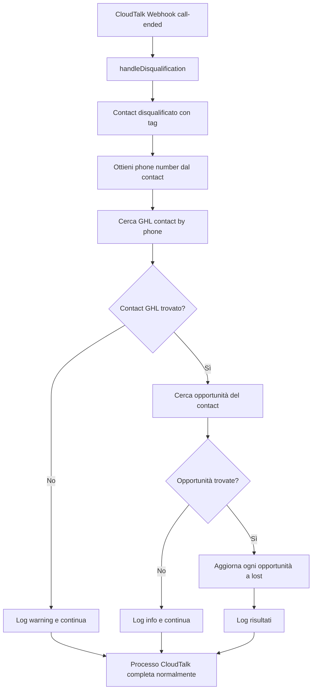

# Integrazione GoHighLevel per Disqualificazione Opportunità

## Panoramica
Quando un contatto viene disqualificato in CloudTalk (tramite tag come "Bambino", "Non Risponde", ecc.), il sistema deve automaticamente aggiornare tutte le opportunità aperte associate in GoHighLevel impostandole come "lost" con il motivo appropriato.

## Flow Completo



## API Endpoints GoHighLevel

### 1. Search Opportunities by Contact
```javascript
GET https://services.leadconnectorhq.com/opportunities/search
Query Parameters:
  - location_id: {GHL_LOCATION_ID} (required)
  - contact_id: {contact_id_from_ghl} (required)
  - status: "open" (optional - filtra solo quelle aperte)
  - limit: 20 (default)

Headers:
  - Authorization: Bearer {GHL_API_KEY}
  - Version: 2021-07-28
  - Content-Type: application/json
```

### 2. Update Opportunity Status
```javascript
PUT https://services.leadconnectorhq.com/opportunities/{opportunity_id}/status
Headers:
  - Authorization: Bearer {GHL_API_KEY}
  - Version: 2021-07-28
  - Content-Type: application/json

Body:
{
  "status": "lost"
}
```

### 3. Update Opportunity with Custom Fields
```javascript
PUT https://services.leadconnectorhq.com/opportunities/{opportunity_id}
Headers:
  - Authorization: Bearer {GHL_API_KEY}
  - Version: 2021-07-28
  - Content-Type: application/json

Body:
{
  "status": "lost",
  "customFields": [
    {
      "key": "lost_reason",
      "field_value": "Bambino"
    }
  ]
}
```

## Implementazione Codice

### 1. Funzione per Cercare Opportunità

```javascript
/**
 * Cerca tutte le opportunità aperte di un contatto GHL
 * @param {string} contactId - ID del contatto in GoHighLevel
 * @param {string} correlationId - ID per logging
 * @returns {Promise<Array>} Array di opportunità trovate
 */
async function searchGHLOpportunitiesByContact(contactId, correlationId) {
  const apiKey = process.env.GHL_API_KEY;
  const locationId = process.env.GHL_LOCATION_ID;

  if (!apiKey || !locationId) {
    console.error(`[${correlationId}] Missing GHL API credentials`);
    return [];
  }

  try {
    const url = new URL('https://services.leadconnectorhq.com/opportunities/search');
    url.searchParams.append('location_id', locationId);
    url.searchParams.append('contact_id', contactId);
    url.searchParams.append('status', 'open'); // Solo opportunità aperte
    url.searchParams.append('limit', '100'); // Prendi tutte le opportunità

    const response = await fetch(url.toString(), {
      method: 'GET',
      headers: {
        'Authorization': `Bearer ${apiKey}`,
        'Version': '2021-07-28',
        'Content-Type': 'application/json'
      },
      timeout: 10000 // 10 secondi timeout
    });

    // Log rate limiting info
    const rateLimit = response.headers.get('x-ratelimit-remaining');
    if (rateLimit) {
      console.log(`[${correlationId}] GHL Rate limit remaining: ${rateLimit}`);
    }

    if (!response.ok) {
      // Gestione errori specifici
      if (response.status === 401) {
        console.error(`[${correlationId}] GHL Auth failed - check API key`);
      } else if (response.status === 429) {
        console.error(`[${correlationId}] GHL Rate limit exceeded`);
      } else if (response.status === 404) {
        console.error(`[${correlationId}] GHL Contact not found: ${contactId}`);
      } else {
        const errorText = await response.text();
        console.error(`[${correlationId}] GHL API error ${response.status}: ${errorText}`);
      }
      return [];
    }

    const data = await response.json();
    const opportunities = data.opportunities || [];

    console.log(`[${correlationId}] Found ${opportunities.length} open opportunities for contact ${contactId}`);

    return opportunities;

  } catch (error) {
    // Non bloccare il processo CloudTalk per errori GHL
    console.error(`[${correlationId}] Error searching GHL opportunities:`, error.message);
    return [];
  }
}
```

### 2. Funzione per Aggiornare Opportunità a Lost

```javascript
/**
 * Aggiorna un'opportunità GHL a status "lost" con motivo
 * @param {string} opportunityId - ID dell'opportunità
 * @param {string} lostReason - Motivo della perdita (es. "Bambino", "Non Risponde")
 * @param {string} correlationId - ID per logging
 * @returns {Promise<Object>} Risultato dell'aggiornamento
 */
async function updateGHLOpportunityToLost(opportunityId, lostReason, correlationId) {
  const apiKey = process.env.GHL_API_KEY;

  if (!apiKey) {
    return { success: false, error: 'Missing GHL API key' };
  }

  try {
    // Prepara il body con status e custom field per il motivo
    const updateBody = {
      status: "lost"
    };

    // Se abbiamo un motivo specifico, aggiungiamolo ai custom fields
    if (lostReason) {
      updateBody.customFields = [
        {
          key: "lost_reason",
          field_value: lostReason
        }
      ];
    }

    const response = await fetch(
      `https://services.leadconnectorhq.com/opportunities/${opportunityId}`,
      {
        method: 'PUT',
        headers: {
          'Authorization': `Bearer ${apiKey}`,
          'Version': '2021-07-28',
          'Content-Type': 'application/json'
        },
        body: JSON.stringify(updateBody),
        timeout: 10000 // 10 secondi timeout
      }
    );

    if (!response.ok) {
      // Gestione errori non bloccanti
      if (response.status === 404) {
        console.warn(`[${correlationId}] Opportunity not found: ${opportunityId}`);
        return { success: false, error: 'Opportunity not found' };
      } else if (response.status === 400) {
        // Potrebbe già essere "lost" o status non valido
        const errorText = await response.text();
        console.warn(`[${correlationId}] Cannot update opportunity ${opportunityId}: ${errorText}`);
        return { success: false, error: 'Invalid status transition' };
      } else if (response.status === 429) {
        console.error(`[${correlationId}] GHL Rate limit exceeded for opportunity update`);
        return { success: false, error: 'Rate limit exceeded' };
      } else {
        const errorText = await response.text();
        console.error(`[${correlationId}] GHL API error ${response.status}: ${errorText}`);
        return { success: false, error: `API error ${response.status}` };
      }
    }

    const data = await response.json();
    console.log(`[${correlationId}] Successfully updated opportunity ${opportunityId} to lost (reason: ${lostReason})`);

    return {
      success: true,
      opportunity: data.opportunity
    };

  } catch (error) {
    // Non bloccare il processo principale
    console.error(`[${correlationId}] Error updating GHL opportunity:`, error.message);
    return {
      success: false,
      error: error.message
    };
  }
}
```

### 3. Funzione Helper per Ottenere Lost Reason dal Tag

```javascript
/**
 * Mappa i tag di disqualificazione CloudTalk ai motivi di perdita GHL
 * @param {Array<string>} disqualificationTags - Array di tag CloudTalk
 * @returns {string} Lost reason per GHL
 */
function mapDisqualificationTagToLostReason(disqualificationTags) {
  // Mappatura tag CloudTalk -> GHL lost reasons
  const tagMapping = {
    'Bambino': 'Bambino',
    'Non Risponde': 'Non Risponde',
    'Non Interessato': 'Non Interessato',
    'Numero Errato': 'Numero Errato',
    'Già Cliente': 'Già Cliente',
    'Fuori Target': 'Fuori Target'
  };

  // Trova il primo tag che corrisponde
  for (const tag of disqualificationTags) {
    if (tagMapping[tag]) {
      return tagMapping[tag];
    }
  }

  // Default generico
  return 'Disqualificato';
}
```

### 4. Integrazione in handleDisqualification

```javascript
// Importa le funzioni necessarie all'inizio del file
import { searchGHLContactByPhone } from '../API Squadd/tests/search-contact-by-phone.js';

/**
 * Versione aggiornata di handleDisqualification con integrazione GHL
 */
async function handleDisqualification(contactId, contactData, disqualificationTags, existingTags, correlationId) {
  try {
    logAutomation('info', correlationId, {
      action: 'disqualification_start',
      contact_id: contactId,
      contact_name: contactData?.name,
      disqualification_tags: disqualificationTags,
      existing_tags: existingTags
    });

    // === PARTE ESISTENTE: Aggiornamento CloudTalk ===

    // Filter out campaign tags, keep other tags
    const nonCampaignTags = existingTags.filter(tag =>
      !CAMPAIGN_TAGS_TO_REMOVE.includes(tag)
    );

    // Add disqualification tags (avoid duplicates)
    const finalTags = [...new Set([...nonCampaignTags, ...disqualificationTags])];

    logAutomation('info', correlationId, {
      action: 'disqualification_tag_calculation',
      contact_id: contactId,
      removed_tags: existingTags.filter(tag => CAMPAIGN_TAGS_TO_REMOVE.includes(tag)),
      added_tags: disqualificationTags,
      final_tags: finalTags
    });

    // Update contact tags in CloudTalk
    const updateResult = await updateContactTags(contactId, finalTags, contactData, correlationId);

    if (!updateResult.success) {
      logAutomation('error', correlationId, {
        action: 'disqualification_update_failed',
        contact_id: contactId,
        error: updateResult.error
      });

      return {
        success: false,
        disqualification: true,
        error: updateResult.error
      };
    }

    // === NUOVA PARTE: Integrazione GoHighLevel ===

    // Aggiorna opportunità GHL in modo asincrono (non bloccante)
    updateGHLOpportunitiesAsync(contactData, disqualificationTags, correlationId);

    // === FINE PARTE NUOVA ===

    logAutomation('info', correlationId, {
      action: 'disqualification_complete',
      contact_id: contactId,
      final_tags: finalTags,
      removed_campaign_tags: existingTags.filter(tag => CAMPAIGN_TAGS_TO_REMOVE.includes(tag))
    });

    return {
      success: true,
      disqualification: true,
      removedTags: existingTags.filter(tag => CAMPAIGN_TAGS_TO_REMOVE.includes(tag)),
      addedTags: disqualificationTags,
      finalTags: finalTags
    };

  } catch (error) {
    logAutomation('error', correlationId, {
      action: 'disqualification_error',
      contact_id: contactId,
      error: error.message,
      stack: error.stack
    });

    return {
      success: false,
      disqualification: true,
      error: error.message
    };
  }
}

/**
 * Aggiorna le opportunità GHL in modo asincrono
 * Non bloccante per il processo principale CloudTalk
 */
async function updateGHLOpportunitiesAsync(contactData, disqualificationTags, correlationId) {
  try {
    // Estrai il numero di telefono dal contatto CloudTalk
    const phoneNumber = contactData?.phone || contactData?.number;

    if (!phoneNumber) {
      console.log(`[${correlationId}] No phone number found for GHL sync`);
      return;
    }

    logAutomation('info', correlationId, {
      action: 'ghl_sync_start',
      phone: phoneNumber,
      tags: disqualificationTags
    });

    // Step 1: Trova il contatto GHL tramite telefono
    const ghlContact = await searchGHLContactByPhone(phoneNumber);

    if (!ghlContact) {
      logAutomation('warn', correlationId, {
        action: 'ghl_contact_not_found',
        phone: phoneNumber
      });
      return;
    }

    logAutomation('info', correlationId, {
      action: 'ghl_contact_found',
      contact_id: ghlContact.id,
      contact_name: `${ghlContact.firstName || ''} ${ghlContact.lastName || ''}`.trim()
    });

    // Step 2: Cerca le opportunità aperte del contatto
    const opportunities = await searchGHLOpportunitiesByContact(ghlContact.id, correlationId);

    if (opportunities.length === 0) {
      logAutomation('info', correlationId, {
        action: 'ghl_no_opportunities',
        contact_id: ghlContact.id
      });
      return;
    }

    // Step 3: Determina il motivo della perdita
    const lostReason = mapDisqualificationTagToLostReason(disqualificationTags);

    logAutomation('info', correlationId, {
      action: 'ghl_updating_opportunities',
      count: opportunities.length,
      lost_reason: lostReason
    });

    // Step 4: Aggiorna ogni opportunità (in parallelo con limite)
    const updatePromises = opportunities.map(async (opp) => {
      // Se l'opportunità è già "lost", skip
      if (opp.status === 'lost') {
        console.log(`[${correlationId}] Opportunity ${opp.id} already lost, skipping`);
        return { opportunityId: opp.id, skipped: true };
      }

      const result = await updateGHLOpportunityToLost(opp.id, lostReason, correlationId);
      return {
        opportunityId: opp.id,
        ...result
      };
    });

    // Esegui max 5 update in parallelo per evitare rate limiting
    const chunkSize = 5;
    const results = [];

    for (let i = 0; i < updatePromises.length; i += chunkSize) {
      const chunk = updatePromises.slice(i, i + chunkSize);
      const chunkResults = await Promise.all(chunk);
      results.push(...chunkResults);

      // Piccolo delay tra i batch per rispettare rate limits
      if (i + chunkSize < updatePromises.length) {
        await new Promise(resolve => setTimeout(resolve, 200));
      }
    }

    // Log risultati
    const successful = results.filter(r => r.success).length;
    const failed = results.filter(r => !r.success && !r.skipped).length;
    const skipped = results.filter(r => r.skipped).length;

    logAutomation('info', correlationId, {
      action: 'ghl_sync_complete',
      total_opportunities: opportunities.length,
      successful_updates: successful,
      failed_updates: failed,
      skipped_already_lost: skipped
    });

  } catch (error) {
    // Log ma non bloccare il processo principale
    logAutomation('error', correlationId, {
      action: 'ghl_sync_error',
      error: error.message,
      stack: error.stack
    });
  }
}
```

## Edge Cases e Gestione Errori

### 1. Contatto GHL Non Trovato
- **Scenario**: Il numero di telefono CloudTalk non corrisponde a nessun contatto in GHL
- **Gestione**: Log warning e continua il processo CloudTalk normalmente
- **Non blocca** l'aggiornamento CloudTalk

### 2. Nessuna Opportunità Trovata
- **Scenario**: Il contatto GHL esiste ma non ha opportunità associate
- **Gestione**: Log informativo e continua
- **Comportamento**: Normale, molti contatti potrebbero non avere opportunità

### 3. Opportunità Già in Status "Lost"
- **Scenario**: L'opportunità è già stata chiusa come persa
- **Gestione**: Skip l'aggiornamento per evitare errori API
- **Log**: Registra come "skipped"

### 4. Multiple Opportunità
- **Scenario**: Un contatto ha N opportunità aperte
- **Gestione**:
  - Aggiorna tutte le opportunità aperte
  - Usa batch processing (max 5 in parallelo)
  - Delay di 200ms tra batch per rate limiting

### 5. Rate Limiting GHL
- **Scenario**: Troppe richieste API in poco tempo
- **Gestione**:
  - Monitora header `x-ratelimit-remaining`
  - Batch processing con delay
  - Se 429 error, log e continua senza retry

### 6. Timeout API
- **Scenario**: GHL API non risponde entro 10 secondi
- **Gestione**:
  - Timeout configurato a 10 secondi
  - Log errore e continua
  - Non retry automatico

## Performance Considerations

### 1. Elaborazione Asincrona
```javascript
// Il processo GHL non blocca CloudTalk
updateGHLOpportunitiesAsync(contactData, disqualificationTags, correlationId);
// CloudTalk continua immediatamente
```

### 2. Batch Processing
- Max 5 opportunità aggiornate in parallelo
- 200ms delay tra batch
- Previene rate limiting

### 3. Timeout Management
- 10 secondi timeout per ogni chiamata API
- Nessun retry automatico per evitare ritardi

### 4. Logging Strutturato
- Ogni operazione loggata con correlationId
- Facile debugging e monitoring
- Metriche di successo/fallimento

## Testing

### Test Unitari

```javascript
// test-ghl-opportunity-disqualification.js

async function testDisqualificationFlow() {
  const testPhone = '+393936815798';
  const testTags = ['Bambino'];
  const correlationId = `test-${Date.now()}`;

  console.log('🧪 Test Disqualification Flow');

  // Test 1: Trova contatto
  const contact = await searchGHLContactByPhone(testPhone);
  assert(contact, 'Contact should be found');

  // Test 2: Cerca opportunità
  const opportunities = await searchGHLOpportunitiesByContact(
    contact.id,
    correlationId
  );
  console.log(`Found ${opportunities.length} opportunities`);

  // Test 3: Aggiorna una opportunità test
  if (opportunities.length > 0) {
    const result = await updateGHLOpportunityToLost(
      opportunities[0].id,
      'Test Disqualification',
      correlationId
    );
    assert(result.success, 'Update should succeed');
  }

  console.log('✅ All tests passed');
}
```

### Test di Integrazione

```javascript
// Simula webhook CloudTalk con disqualificazione
const webhookPayload = {
  event: 'call-ended',
  data: {
    contact: {
      id: 'ct-123',
      phone: '+393936815798',
      tags: ['Bambino']
    }
  }
};

// Processa tramite sistema completo
await processCallEndedWebhook(webhookPayload, 'test-correlation-id');
```

## Monitoring e Metriche

### KPI da Monitorare
1. **Success Rate**: % opportunità aggiornate con successo
2. **Response Time**: Tempo medio per aggiornare opportunità
3. **Error Rate**: % di fallimenti GHL API
4. **Rate Limit Usage**: Utilizzo del rate limit GHL

### Log Pattern per Monitoring
```javascript
// Successo
[correlation-123] GHL sync complete: 3 opportunities updated to lost

// Warning
[correlation-456] GHL contact not found for phone: +39123456789

// Error (non bloccante)
[correlation-789] GHL API error 429: Rate limit exceeded
```

## Configurazione ENV

```env
# Required for GHL integration
GHL_API_KEY=your_ghl_api_key
GHL_LOCATION_ID=your_location_id

# Optional: Custom field for lost reason (if different)
GHL_LOST_REASON_FIELD_KEY=lost_reason
```

## Rollout Sicuro

### Fase 1: Dry Run (Logging Only)
```javascript
// Aggiungi flag temporaneo
const GHL_SYNC_ENABLED = process.env.GHL_SYNC_ENABLED === 'true';

if (GHL_SYNC_ENABLED) {
  await updateGHLOpportunitiesAsync(...);
} else {
  console.log('[DRY RUN] Would update GHL opportunities');
}
```

### Fase 2: Soft Launch
- Abilita solo per specifici tag (es. solo "Bambino")
- Monitor per 24-48 ore
- Verifica metriche e logs

### Fase 3: Full Rollout
- Abilita per tutti i tag di disqualificazione
- Monitor continuativo
- Alert su error rate > 5%

## Conclusioni

L'integrazione è progettata per essere:
- **Non bloccante**: Errori GHL non impattano CloudTalk
- **Resiliente**: Gestione completa di tutti gli edge cases
- **Performante**: Batch processing e timeout management
- **Monitorabile**: Logging strutturato con correlationId
- **Sicura**: Rollout graduale con dry run option